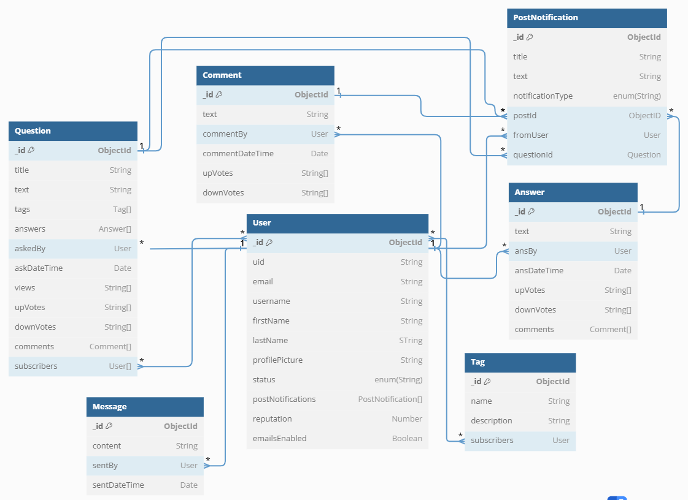

# Remote site: https://cs4530-f24-202.onrender.com

## Table of Contents
1. Introduction
2. Necessary Dependencies & Setup
3. Database Architecture
4. Notable Features
5. Honorable Mentions

### Introduction

### Necessary Dependencies & Setup

### Database Architecture
The schemas for the database are documented in the directory `server/models/schema`.
A class diagram for the schema definition is shown below:

### Notable Features

### Honorable Mentions

{ : .note } The fields of the Schemas were changed. As a result, features such as view counts will not work on database entries that were made in IP1 and IP2. If you want to test features, delete old database entries and make new questions either through manually making it in the client or run populate_db.ts.

### Database Architecture

